본격적으로 useState를 코드레벨에서 까보면서 useState는 어떻게 구현되어있는지, 그리고 reconciler가 무슨 역할을 하는지에 대해 알아보자.  
"**useState 정의된 위치 -> useState의 state -> useState의 setState**" 순서로 포스팅을 작성하려고 한다.  
그럼 이번 포스팅에는 useState가 정의된 위치가 어디인지 파헤쳐보자.  

우리가 분석할 패키지는 react, shared, react-reconciler 패키지이다.  
각 패키지에 대해 간단히 소개하자면  
1. **react 패키지** : react 패키지는 코어 패키지이며, react element가 정의되어있고 그 외는 shared 패키지를 통해 주입받고있다. 
2. **react-reconciler** : react-reconciler는 react element를 VDOM에 반영하기 위해 fiber node로 확장하는 패키지이다.  
3. **shared 패키지** : shared 패키지는 패키지들끼리 의존성을 갖는 부분에 대해 정의되어있는 패키지이며, 통로 역할을 한다.  

그럼 react 패키지 진입점부터 확인해보자.

## react/index.js
이 파일은 단순히 `react/src/ReactClient.js`에서 받아온 정보들을 export하고 있다.

## react/src/ReactClient.js
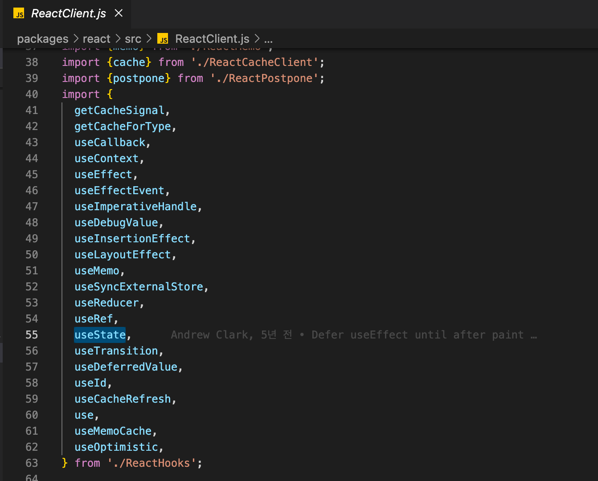  
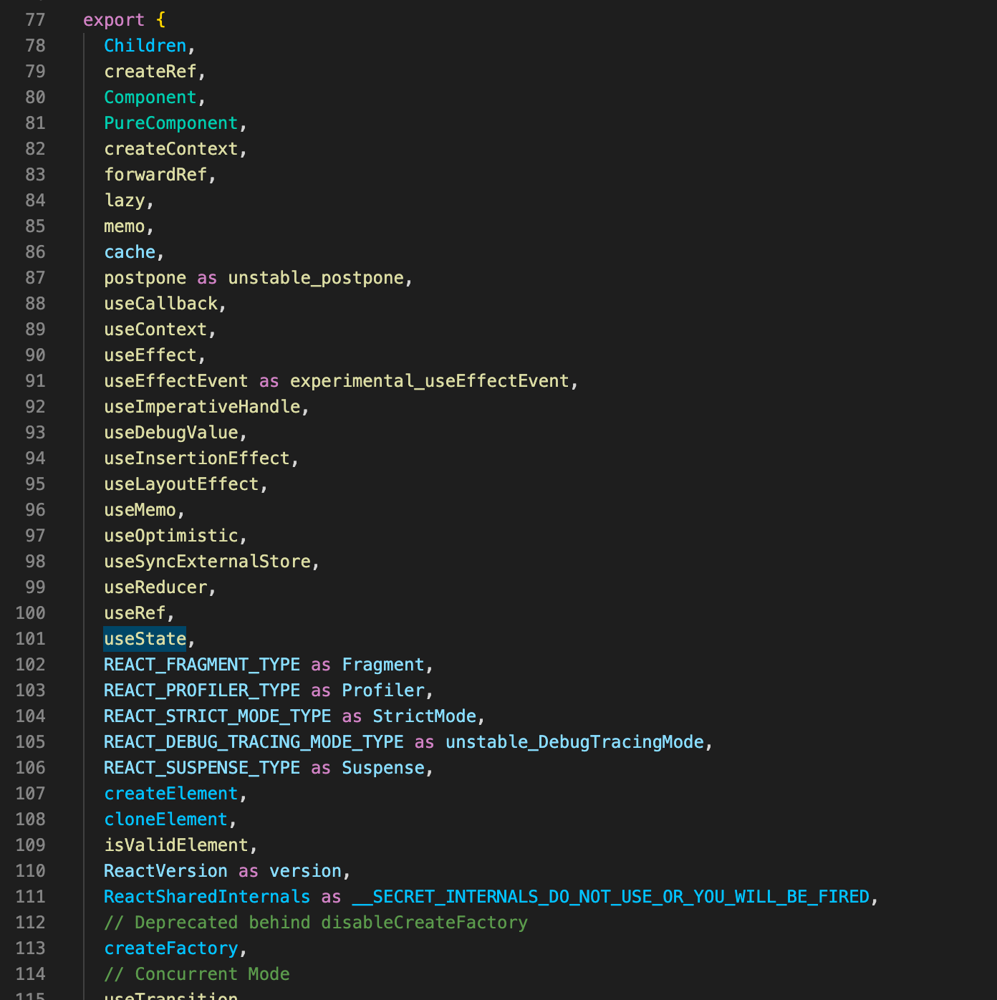  

ReactClient에서 ReactHooks의 useState를 import하여 export하고 있다.

## react/src/ReactHooks.js
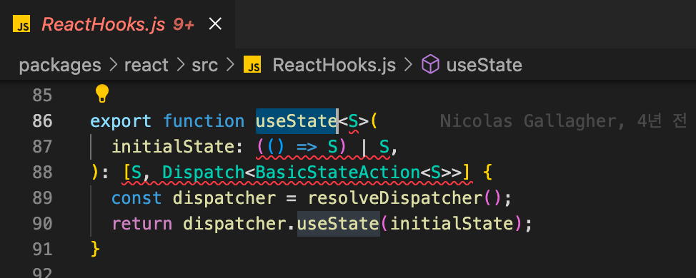  

여기에 useState가 정의되어 export되고 있고,  
resolveDispatcher함수에서 꺼내오는걸 확인할 수 있다.  

- resolveDispatcher 함수
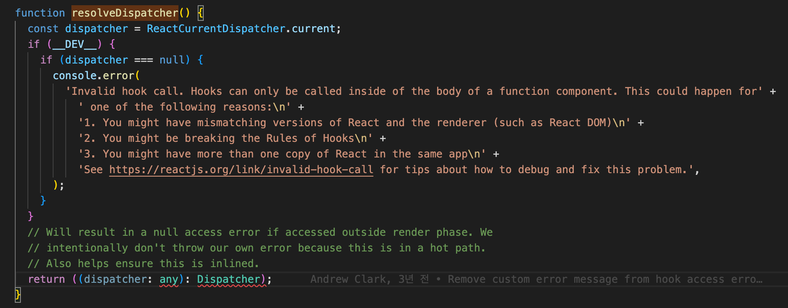  
ReactCurrentDispatcher.current에서 꺼내오고 리턴한다.

## react/src/ReactCurrentDispatcher.js
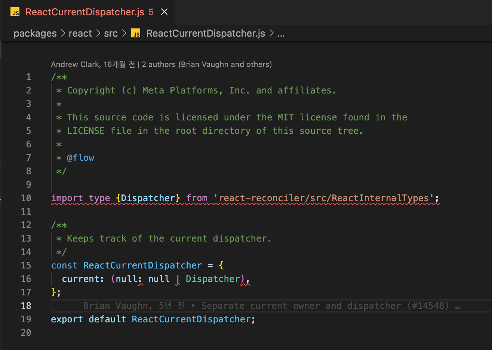  
ReactCurrentDispatcher.current에는 null이 할당되어있다.  

여기까지 확인해보면 react 패키지에는 hook에 대한 코드가 없는 것으로 확인할 수 있다.  
(밑에서 확인해보겠지만, hook 정보는 reconciler가 관리하고 있다.)

## react/src/ReactSharedInternalsClient.js
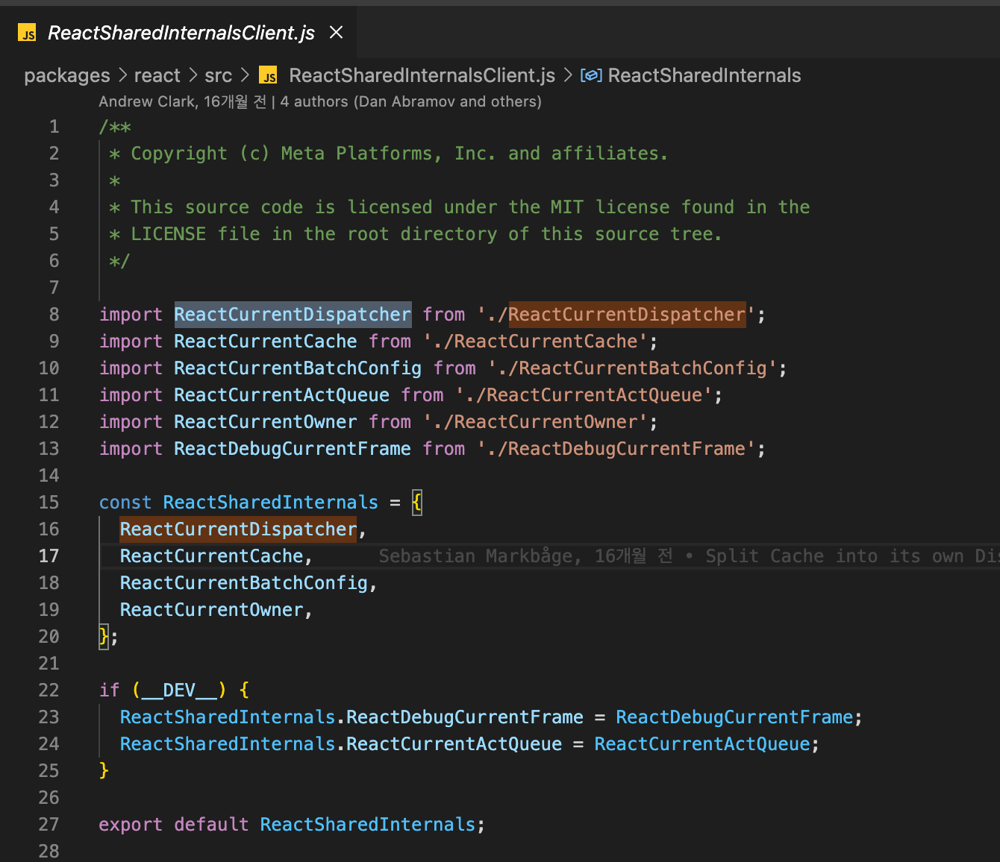  
여기서 ReactCurrentDispatcher를 import하여
ReactSharedInternals 객체의 프로퍼티로 할당하고 있다.  
즉, reconciler로 부터 hook 정보를 ReactSharedInternals를 통해 주입받는 구조인 것이다.  
따라서 shared 패키지의 ReactSharedInternals를 확인해보자.

## shared/ReactSharedInternals.js
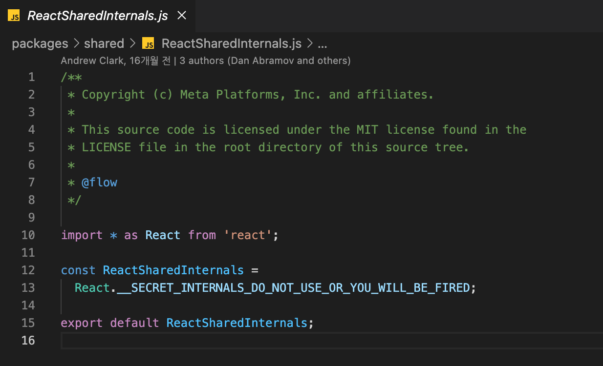  
여기에 정보를 주입하면 react/src/ReactSharedInternals.js 여기로 전달이 되는 구조다.  
전달되는 형태에 대해서는 추후에 자세히 알아볼것이니 지금은 이러한 구조라는 것에 대해 기억하자.  

이제 실질적으로 hook정보를 주입해주는 reconciler 패키지를 뜯어보자.

## react-reconciler/src/ReactFiberHooks.js

- shared 패키지의 ReactSharedInternals를 import한다.
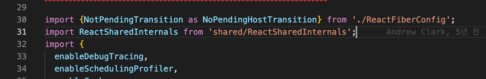  

- ReactSharedInternals에서 ReactCurrentDispatcher를 꺼내온다.  
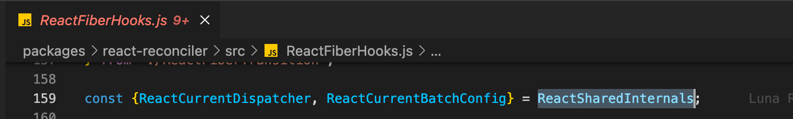  

### renderWithHooks 함수
- ReactCurrentDispatcher.current는 renderWithHooks 함수에서 할당해주고 있다. 
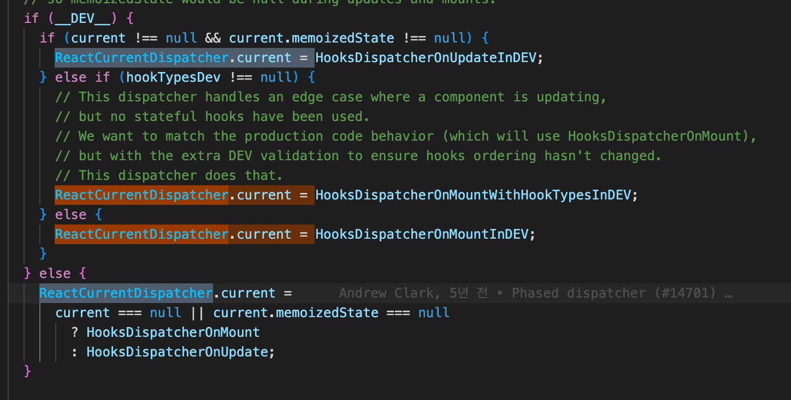  

- 조건절 `current === null || current.memoizedState === null`
현재 current 트리가 없다는 뜻이며, 컴포넌트가 Mount 상태라는 것이다. 
  - true이면, 마운트 hook정보인 HooksDispatcherOnMount를 주입한다.  
  - false이면, 업데이트 상태라는 것이므로 HooksDispatcherOnUpdate를 주입한다.

  - HooksDispatcherOnMount와 HooksDispatcherOnUpdate는 hook 정보들이 담겨있는 객체이다.  
  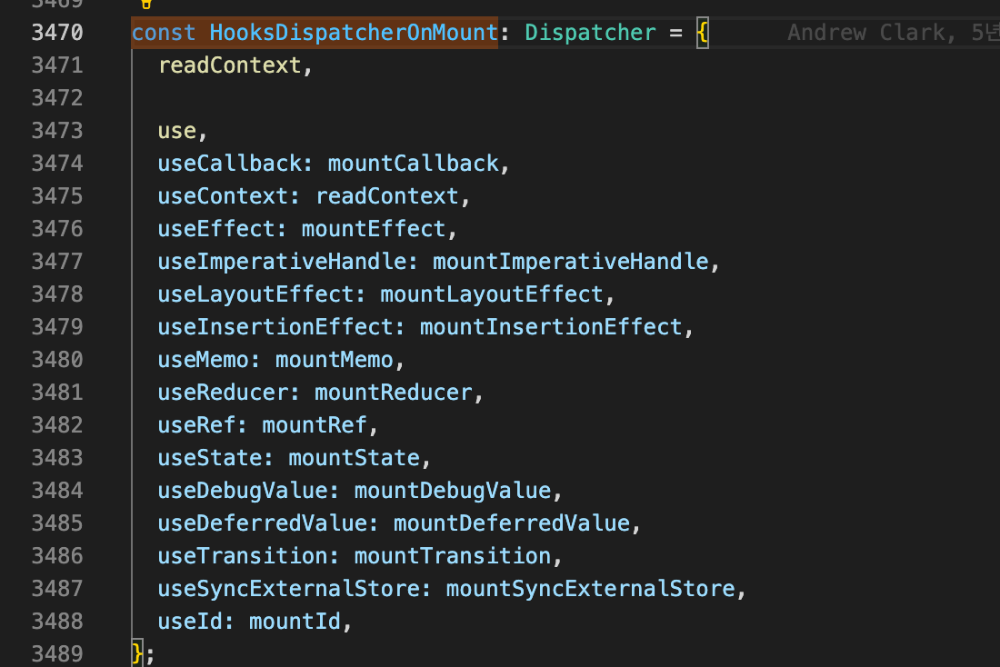  
  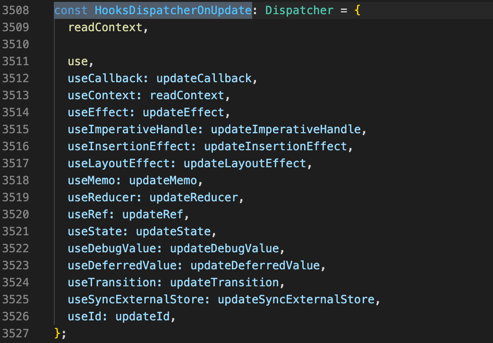  
  **여기서 useState가 mount상태면 mountState, 업데이트상태면 updateState가 할당되는 것을 확인할 수 있다.**

## 정리
정리하자면 useState가 정의된 곳은 react-reconciler의 ReactFiberHooks에서 mountState, updateState 함수이며, useState의 실체는 mountState 또는 updateState인 것이다.

## 마치며
이제 정의된 위치에 대해 살펴보았으니, mountState 함수를 까보면서 useState 내부 코드에 대해 알아보자.

