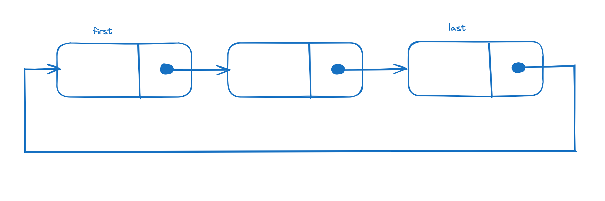

이번 포스팅에서는 useState의 setter함수인 setState 동작 방식과 이를 여러번 호출한다면 어떤일이 발생할지에 대해 알아보겠다.  
컴포넌트가 mount되는 시점에, setState를 호출하는 케이스를 바탕으로 작성하겠다.  

> 코드는 필요없는 주석과 개발모드를 제외하고 가져왔다.

컴포넌트가 마운트될때 useState에 할당되는 함수는 **mountState**이다.

### mountState

```javascript
function mountState<S>(
  initialState: (() => S) | S,
): [S, Dispatch<BasicStateAction<S>>] {
  const hook = mountWorkInProgressHook();
  if (typeof initialState === 'function') {
    initialState = initialState();
  }
  hook.memoizedState = hook.baseState = initialState;
  const queue = (hook.queue = {
    last: null,
    dispatch: null,
    lastRenderedReducer: basicStateReducer,
    lastRenderedState: (initialState: any),
  });
  const dispatch: Dispatch<
    BasicStateAction<S>,
  > = (queue.dispatch = (dispatchAction.bind(
    null,
    // Flow doesn't know this is non-null, but we do.
    ((currentlyRenderingFiber: any): Fiber),
    queue,
  ): any));
  return [hook.memoizedState, dispatch];
}
```
 
mountState에서  **return 배열의 두번째 원소(dispatch)가 바로 setter함수인 setState이다.**  
dispatch는 dispatchAction 함수에 인자가 바인딩되어있는 형태이다.  
dispatchAction 함수를 보자.

### dispatchAction

```javascript
function dispatchAction<S, A>(
  fiber: Fiber,
  queue: UpdateQueue<S, A>,
  action: A,
) {
  const alternate = fiber.alternate;
  if (
    fiber === currentlyRenderingFiber ||  // fiber는 current 또는 workInProgress임, 
    (alternate !== null && alternate === currentlyRenderingFiber)// 따라서 fiber가 workInProgress가 아니면 alternate가 workInProgress인 것이므로 그걸 체크하는것
  ) {
      // ...
  } else {
      // ...
  }
}
```

조건절을 보면, currentlyRenderingFiber(현재 렌더링중인 fiber)가 fiber(current 또는 workInProgress) 동일하거나  
fiber.alternate(current이면 workInProgress, workInProgress이면 current)가 currentlyRenderingFiber와 동일한지 체크한다.  
이게 무슨 의미냐면 render Phase인지 체크하는 조건이다.  
컴포넌트는 기본 상태였다가 스케쥴에 등록되면 -> render phase에 진입하게 된다.  
즉, render phase에서 상태업데이트가 발생한것인지 or 기본 상태에서 상태 업데이트가 발생한 것인지에 따라 setState를 처리하는 방식이 다르다.  

그런데 이때 왜 fiber와 alternate 둘다 체크하냐면, fiber는 current가 될수도 있고 workInProgress도 될 수 있는 더블 버퍼링 구조이기 때문에 둘 다 체크하는 것이다.  

### dispatchAction의 기본 상태 로직

그럼 기본 상태일 때(else 부) 로직을 살펴보자.

#### 1. **update 객체 생성**

```javascript
const update: Update<S, A> = {
    expirationTime,
    suspenseConfig,
    action,// setState에 인자로 넣어주는것
    eagerReducer: null,
    eagerState: null,
    next: null,// 다음 노드의 레퍼런스값 저장
};
```

update 객체를 생성한다. 이때 **우리가 setState에 넘긴 인자인 action을 프로퍼티로 넣는다**  
eagerState는 예상상태로 action을 적용했을때 바뀔 상태를 의미하고  
next는 다음 노드의 레퍼런스 값을 가리키는 포인터 역할을 한다. 이를 통해 우리는 링크드 리스트 구조라는 것을 알 수 있다.

#### 2. **queue.last에 update객체 저장(순환 링크드 리스트 구조)**

```javascript
// 순환 링크드 리스트 구조로 update를 queue에 저장하고있다.
const last = queue.last;
if (last === null) {
    update.next = update;
} else {
    const first = last.next;
    if (first !== null) {
    // Still circular.
    update.next = first;
    }
    last.next = update;
}
queue.last = update;
```

queue객체의 last 프로퍼티에 update객체를 할당하는데, 여기서 setState를 여러번 호출하는 경우 또 이 부분이 타게 되면서   
순환 링크드 리스트 구조로 **queue.last.next는 첫번째 업데이트를, queue.last는 마지막 업데이트를 가리키게된다.**  

- 순환 링크드 리스트 구조
  - 순환 링크드 리스트 구조는 링크드 리스트 구조인데, 마지막 노드의 next가 항상 첫번째 노드를 가리키도록 하는 구조이다.

    

- 순환 링크드 리스트 구조로 관리하는 이유는 배치 업데이트를 효율적으로 처리하기 위함이며, 여러 상태변경이 발생되는 경우 한번에 모든 업데이트를 순회하고 적용할 수 있다.


#### 3. 불필요한 렌더링이 발생하지 않도록 최적화


```javascript
if (
      fiber.expirationTime === NoWork &&
      (alternate === null || alternate.expirationTime === NoWork)
    ) {
      const lastRenderedReducer = queue.lastRenderedReducer;
      if (lastRenderedReducer !== null) {
        let prevDispatcher;
        try {
          const currentState: S = (queue.lastRenderedState: any);
          const eagerState = lastRenderedReducer(currentState, action);// action을 적용한 예상상태

          update.eagerReducer = lastRenderedReducer;
          update.eagerState = eagerState;
          // 불필요한 렌더링이 발생하지않도록 최적화(이전상태와 예상상태가 같으면 return으로 함수실행종료 및 스케쥴에 work를 등록하지않는다)
          if (is(eagerState, currentState)) {

            return;
          }
        } catch (error) {
          // Suppress the error. It will throw again in the render phase.
        } finally {
          if (__DEV__) {
            ReactCurrentDispatcher.current = prevDispatcher;
          }
        }
      }
    }

```
currentState(현재 상태)와 eagerState(action을 적용한 예상 상태)를 비교하여 같으면 return으로 함수를 종료 시켜 스케쥴에 등록하지않는다.  


#### 4. update를 적용하기 위해 스케쥴에 work를 등록
```javascript
    scheduleWork(fiber, expirationTime);// update를 적용하기 위해 스케쥴에 work를 등록
```

### dispatchAction의 렌더 단계 업데이트인 경우 로직

render phase 업데이트일 때 로직을 보자.  

#### 1. didScheduleRenderPhaseUpdate 플래그를 true로 할당한다. 
```javascript
didScheduleRenderPhaseUpdate = true;
```

#### 2. update 객체를 생성한다.
```javascript
const update: Update<S, A> = {
    expirationTime: renderExpirationTime,
    suspenseConfig: null,
    action,
    eagerReducer: null,
    eagerState: null,
    next: null,
};
```

#### 3. renderPhaseUpdates를 Map 자료구조로 생성하고(null이라면), queue를 키로 꺼내온다. 
```javascript
if (renderPhaseUpdates === null) {
    renderPhaseUpdates = new Map();//업데이트 보관소
}
const firstRenderPhaseUpdate = renderPhaseUpdates.get(queue);
```

#### 4. queue를 키로 갖고있는 데이터가 없다면, update를 저장한다.
```javascript
if (firstRenderPhaseUpdate === undefined) {
    renderPhaseUpdates.set(queue, update);
} else {
```

#### 5. 존재한다면, 링크드 리스트 형태로 마지막 노드가 나올때까지(while) 반복하여 마지막 노드.next에 update를 저장한다.
```javascript
} else {
    // 링크드 리스트 형태로 renderPhaseUpdates에 저장되고 있다. 
    let lastRenderPhaseUpdate = firstRenderPhaseUpdate;
    while (lastRenderPhaseUpdate.next !== null) {
    lastRenderPhaseUpdate = lastRenderPhaseUpdate.next;
    }
    lastRenderPhaseUpdate.next = update;
}
```
렌더 단계 업데이트인 경우, update가 링크드 리스트 구조이며 이를 Map에 저장하고 있다.  
이렇게 하는 이유는 렌더 단계에서의 업데이트를 추적하고 순서를 관리하기 위해 사용된다.  

여기까지 dispatchAction 함수 분석은 끝났다.  
그렇다면 didScheduleRenderPhaseUpdate 전역변수는 어디서 활용되는 걸까?  
그건 바로 renderWithHooks이다.

### renderWithHooks
```javascript
export function renderWithHooks(
  current: Fiber | null,
  workInProgress: Fiber,
  Component: any,
  props: any,
  refOrContext: any,
  nextRenderExpirationTime: ExpirationTime,
): any {

let children = Component(props, refOrContext);// 컴포넌트 호출이 끝나고 

  if (didScheduleRenderPhaseUpdate) {// true이면 렌더단계 업데이트 발생했다라는 뜻
    do {
      didScheduleRenderPhaseUpdate = false;
      numberOfReRenders += 1;

      nextCurrentHook = current !== null ? current.memoizedState : null;
      nextWorkInProgressHook = firstWorkInProgressHook;

      currentHook = null;
      workInProgressHook = null;
      componentUpdateQueue = null;

      ReactCurrentDispatcher.current = __DEV__
        ? HooksDispatcherOnUpdateInDEV
        : HooksDispatcherOnUpdate; // ReactCurrentDispatcher.current에 이번엔 update hook을 할당한다.

      children = Component(props, refOrContext);// 컴포넌트 재호출
    } while (didScheduleRenderPhaseUpdate);// false일 때까지 반복

    renderPhaseUpdates = null;
    numberOfReRenders = 0;
  }

  ...
}
```

컴포넌트 호출이 끝나고 didScheduleRenderPhaseUpdate 플래그가 true이면 렌더 단계 업데이트 발생을 감지하고  
numberOfReRenders 숫자를 증가시키고 훅을 update로 교체하여 컴포넌트를 재호출한다.  
위 과정은 false일 때까지 반복된다.  

여기서 우리는 2가지를 알 수 있다.  
1. 훅이 HooksDispatcherOnUpdate(update 훅)으로 교체되었다는 점
2. numberOfReRenders 카운팅하고 있다는 점

2가지를 알아보자.  

#### HooksDispatcherOnUpdate

```javascript
const HooksDispatcherOnUpdate: Dispatcher = {
  readContext,

  useCallback: updateCallback,
  useContext: readContext,
  useEffect: updateEffect,
  useImperativeHandle: updateImperativeHandle,
  useLayoutEffect: updateLayoutEffect,
  useMemo: updateMemo,
  useReducer: updateReducer,
  useRef: updateRef,
  useState: updateState,
  useDebugValue: updateDebugValue,
  useResponder: createResponderListener,
  useDeferredValue: updateDeferredValue,
  useTransition: updateTransition,
};
```
mount와 다르게 useState는 mountState가 아닌 **updateState가 할당되어 있다.**  
이는 컴포넌트 재호출할 때 setter함수는 이제 updateState 함수를 호출하게 된다라는 의미이다.  

#### numberOfReRenders

```javascript
function dispatchAction<S, A>(
  fiber: Fiber,
  queue: UpdateQueue<S, A>,
  action: A,
) {
  invariant(
    numberOfReRenders < RE_RENDER_LIMIT,
    'Too many re-renders. React limits the number of renders to prevent ' +
      'an infinite loop.',
  );
```
numberOfReRenders는 dispatchAction에서 한계 숫자를 넘으면 오류가 발생하도록 체크하고 있다.  
오류 메세지는 우리가 상태업데이트가 무한루프에 빠졌을 때 가끔 보게 되는 메세지다.  
참고로 RE_RENDER_LIMIT 한계는 25로 정의되어있다.(`const RE_RENDER_LIMIT = 25;`)  


## 마치며
이번 포스팅에서는 setState 내부 코드와 여러번 호출하면 어떤일이 발생하는지에 대해 알아보았다.  
다음 시간에는 스케쥴에 work를 등록하는 과정에 대해 알아보자.  
